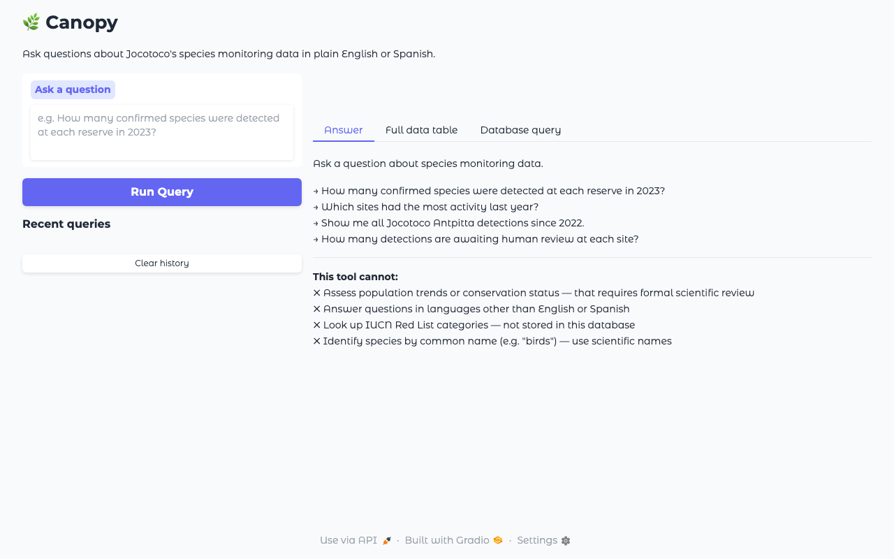
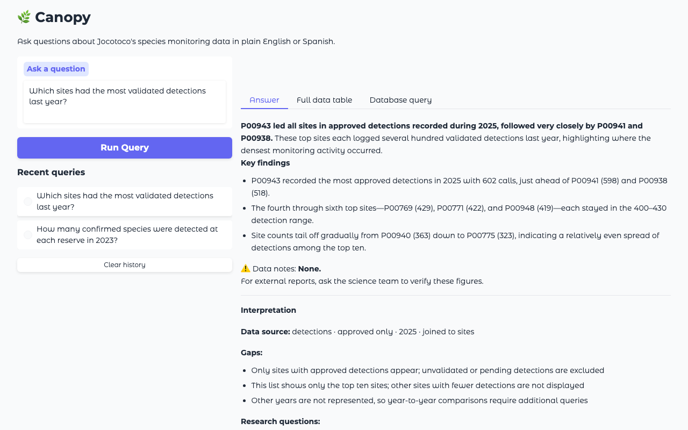
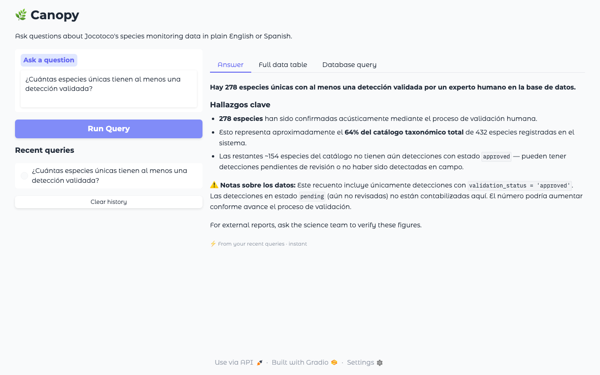
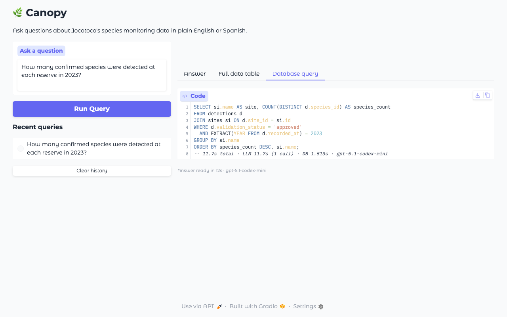
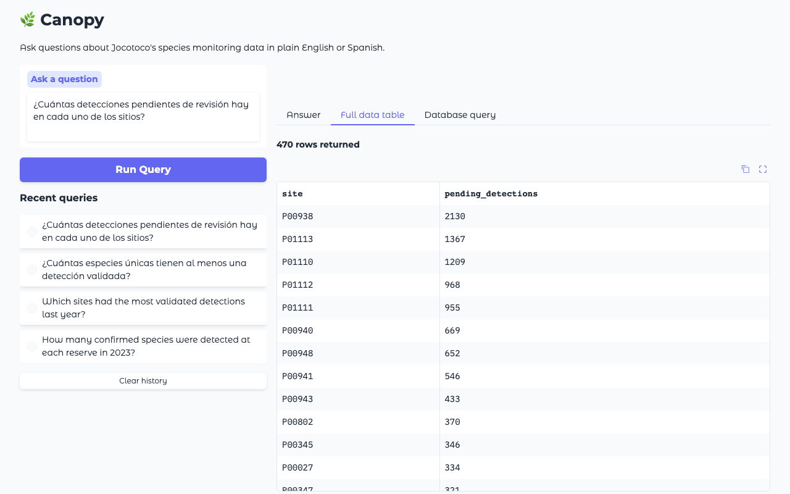

# canopy

[](https://github.com/ajinkyabhanudas/canopy/actions/workflows/ci.yml)
[](https://codecov.io/gh/ajinkyabhanudas/canopy)
[](https://docs.python.org/3.11/)
[](https://github.com/astral-sh/ruff)
[](Dockerfile)
[](DECISIONS.md)

A natural language query tool for Jocotoco's bioacoustic species-monitoring
database. Ask a question in plain English (or Spanish), canopy translates it
into a SQL query, executes it read-only against the database, and returns a
plain-language answer alongside the SQL for inspection.

## Example

```
Q: How many confirmed species were detected at each reserve in 2023?

Answer:
  In 2023, confirmed species were detected across 14 recording sites.

  Key findings:
  • Buenaventura led with 63 confirmed species.
  • El Pambilar recorded 41 species.
  • La Hesperia recorded 38 species.

  ⚠️ Data notes: Figures show detections with validation_status = 'approved'.
  For external reports, ask the science team to verify these figures.

SQL (shown in "Database query" tab):
  SELECT si.name AS site, COUNT(DISTINCT d.species_id) AS species_count
  FROM detections d
    JOIN sites si ON d.site_id = si.id
  WHERE d.validation_status = 'approved'
    AND EXTRACT(YEAR FROM d.recorded_at) = 2023
  GROUP BY si.name
  ORDER BY species_count DESC
```

---

| Idle — question input, history sidebar, example prompts | Result — structured answer with headline, findings, and data notes |
|---|---|
|  |  |

---

## What it does

- Accepts natural language questions in **English or Spanish** — responds in
  whichever language you write in, without any configuration.
- Uses Claude to generate a PostgreSQL SELECT query — never guesses results.
- Executes read-only against PostgreSQL and returns a structured answer
  (headline → key findings → data notes) alongside the data table and SQL.
- Caches results for 24 hours by question text so repeated queries return
  instantly without an LLM or DB call.
- Streams live progress while the query runs — what the model understood, which
  pipeline stage is active, how many records were found.
- Persists query history to disk (last 20 queries surfaced in the UI sidebar);
  clicking a history item auto-runs the query from cache.
- Never infers population trends or conservation status — that requires a formal
  scientific review process, not automated inference.
- Precise species coordinates are filtered before any data reaches the AI layer,
  keeping sensitive biodiversity locations out of the model context.
- Vendor-neutral model interface: swapping the LLM means adding one adapter file.

## Requirements

- Python 3.11+ (local) or Docker (recommended for deployment)
- An Anthropic API key
- PostgreSQL credentials for the VAJocotoco database

---

## Quickstart — Docker (recommended)

### 1. Configure

```bash
cp .env.example .env
```

Edit `.env` and fill in all required values. Never commit `.env`.

| Variable | Required | Description |
|---|---|---|
| `ANTHROPIC_API_KEY` | Yes | Anthropic API key |
| `ANTHROPIC_MODEL` | No | Model ID (default: `claude-sonnet-4-6`) |
| `MODEL_BACKEND` | No | Backend (default: `anthropic`) |
| `PG_HOST` | Yes | PostgreSQL host |
| `PG_PORT` | Yes | PostgreSQL port (usually `5432`) |
| `PG_DBNAME` | Yes | Database name |
| `PG_USER` | Yes | Database user (read-only) |
| `PG_PASSWORD` | Yes | Database password |
| `ANTHROPIC_TIMEOUT` | No | API timeout in seconds (default: `60`) |
| `CANOPY_DATA_DIR` | No | History + cache file location — Docker only, do not set locally |
| `CANOPY_CACHE_TTL_HOURS` | No | Cache TTL in hours (default: `24`) |
| `CANOPY_UI_LANG` | No | UI label language: `en` (default) or `es` (Spanish). Model responses always auto-detect from question language — this only controls UI labels. |

### 2. Build and run

```bash
make run
```

Open **http://localhost:7860** in a browser.

> **Why not `--env-file`?** Docker's `--env-file` passes surrounding quotes
> literally. `docker_run.sh` sources `.env` via shell so quotes are stripped
> correctly before the container starts.

### 3. Stop

```bash
docker stop $(docker ps -q --filter "ancestor=canopy:dev")
```

---

## Quickstart — Local (no Docker)

```bash
pip install -e ".[dev]"
cp .env.example .env   # fill in values
make ui
```

Open **http://localhost:7860**.

---

## Developer commands

All common tasks are available via `make`. Run `make` (no target) to see the full list.

| Command | What it does |
|---|---|
| `make check` | Lint + unit tests — run before every commit |
| `make lint` | `ruff check src/ tests/ scripts/` |
| `make test` | `pytest tests/ -q` |
| `make ui` | Start the app locally (needs `.env`) |
| `make build` | Build Docker image (`canopy:dev`) |
| `make run` | Build and run in Docker (needs `.env`) |
| `make smoke` | Docker smoke test — validates runtime behaviour unit tests can't catch |
| `make eval` | Ground-truth + adversarial eval (needs live DB + API key) |
| `make eval-es` | Spanish language variant eval |
| `make clean` | Remove build artefacts and caches |

### Manual checks (CLI, no UI)

#### Verify the API key

```bash
python scripts/smoke_test.py
```

#### Verify the database connection

```bash
python -c "
from canopy.db import get_connection
conn = get_connection()
cur = conn.cursor()
cur.execute('SELECT 1')
print('DB connected:', cur.fetchone())
conn.close()
"
```

#### Run a query from the command line

```bash
python -c "
from canopy.query import run_query
result = run_query('What species have been validated at any site?')
print('SQL:', result.sql)
print('Rows:', result.row_count)
print()
print(result.model_text)
"
```

#### Inspect the system prompt

```bash
python -c "from canopy.schema import build_system_prompt; print(build_system_prompt())"
```

---

## Tests

```bash
make check          # lint + unit tests
make test           # unit tests only
make smoke          # Docker runtime validation (requires Docker)
```

Expected unit test result: **299 passed**, ~88% coverage.

The smoke test validates what `pytest` cannot: Docker volume permissions, Gradio
startup warnings, and HTTP availability. Run it after any Dockerfile or Gradio change.

## Eval suites

Three live eval suites — all require `ANTHROPIC_API_KEY` and `PG_*` vars.

```bash
# Ground-truth + adversarial (default)
python scripts/run_eval.py

# Ground-truth only
python scripts/run_eval.py --ground-truth

# Adversarial only
python scripts/run_eval.py --adversarial

# Spanish language variants (8 GT cases in Spanish)
python scripts/run_eval.py --spanish

# Full: ground-truth + Spanish + adversarial
python scripts/run_eval.py --spanish
```

**Ground-truth** — 31 questions covering SQL correctness, result shape,
guardrail adherence, faithfulness (model_text numbers match DB rows),
guardrail bypass variants, and time-relative / live-count queries. Pass threshold: ≥87% (27/31).

**Spanish variants** — 8 parallel cases in Spanish. Same SQL structure checks
as their English equivalents (SQL is always English regardless of question
language). Soft check: model_text must contain Spanish-specific characters.

**Adversarial** — 9 hostile inputs: prompt injection, SQL injection in question
text, persona/roleplay bypass, system prompt extraction, credentials request,
conservation-status judgment request, and hallucination boundary (fabricated
species names → zero rows). Pass threshold: 100% (9/9). A `SQLGuardError`
from the security guard counts as PASS — a blocked attack is the correct outcome.

---

## More screenshots

**Spanish query** — question in Spanish, response in Spanish; SQL is always generated in English regardless



**SQL tab** — the generated query is shown for every result so answers can be verified



**Full data table** — raw rows available alongside the plain-language answer



---

## Architecture

```
src/canopy/
├── config.py          # Env var loading — ModelConfig, DBConfig, get_data_dir(), get_ui_lang()
├── schema.py          # DB schema constant + build_system_prompt() (language instruction included)
├── i18n.py            # set_locale(), t() — UI string localisation singleton
├── locales/
│   ├── en.py          # English string catalog (23 keys — source of truth)
│   └── es.py          # Spanish string catalog
├── _json.py           # Shared JSON encoder (Decimal, datetime) for cache + history
├── history.py         # append_history, load_history, clear_history (JSONL)
├── cache.py           # lookup_cache, write_cache — SHA-256+NFC key, 24h TTL, LRU evict
├── models/
│   ├── base.py        # ModelClient ABC — vendor-neutral interface
│   ├── anthropic.py   # Claude adapter (only backend today)
│   └── registry.py    # get_model_client() — reads MODEL_BACKEND
├── db/
│   └── connection.py  # get_connection() — psycopg2, read-only
├── query/
│   ├── executor.py    # execute_query() — SELECT-only guard + execution
│   └── loop.py        # run_query() — agentic loop, returns LoopResult
└── ui/
    └── app.py         # build_app() — Gradio two-panel UI (all strings via t())

scripts/
├── docker_run.sh      # Docker launcher (handles .env quote stripping)
├── run_ui.py          # Local UI launcher
├── smoke_test.py      # API key / model config check
└── run_eval.py        # Eval runner — ground-truth (27) + adversarial (8) suites

tests/
├── conftest.py        # autouse fixture — redirects CANOPY_DATA_DIR to tmp_path per test
└── eval/
    ├── queries.py     # 30 EvalCase entries (8 with Spanish translation_es); correctness, guardrails, faithfulness
    └── adversarial.py # 8 adversarial cases — injection, persona bypass, hallucination boundary

Dockerfile             # python:3.11-slim, non-root user, /data volume
```

### Key design decisions

- **SELECT-only guard + read-only connection** — `execute_query()` rejects
  non-SELECT statements before touching the DB. The psycopg2 connection is also
  opened with `readonly=True` as belt-and-suspenders.
- **Coordinate filtering** — `latitude` and `longitude` are stripped from query
  results before they reach the model. The user's UI sees the full dataset; the
  AI layer never does. Complies with the principle of not granting agents direct
  access to sensitive biodiversity records.
- **Progressive feedback** — the UI streams live status above the output tabs
  (always visible regardless of which tab is active). The model states what it
  understood from the question before executing SQL, so users can catch
  misinterpretations before waiting 90 seconds.
- **Parallel tool calls** — if Claude returns multiple `tool_use` blocks,
  all are executed and their results are bundled into a single user message
  (Anthropic API requirement).
- **System prompt is a constant** — `SCHEMA_CONTEXT` is a module-level string.
  `build_system_prompt()` is a function so runtime context (language preference,
  etc.) can be injected later without touching the schema constant.
- **Resilient history** — query history is written to `CANOPY_DATA_DIR` in
  Docker (mounted as a named volume) and falls back to `~/.canopy` locally.
  If the configured path can't be created (e.g. `/data` set in a local `.env`),
  the app falls back gracefully rather than silently losing history.
- **Cache round-trip type safety** — `datetime`/`date` columns serialised to ISO
  strings on cache write are reconstructed back to `datetime` objects on read,
  so downstream code sees the same types whether a result is live or cached.

See `LIMITATIONS.md` for known data gaps, cache staleness windows, and UI
behaviour boundaries.

---

## Status

| Component | State |
|---|---|
| Model client interface + Claude adapter | Done |
| DB connection factory | Done |
| Schema context + system prompt | Done |
| SQL executor with SELECT-only guard | Done |
| Agentic query loop | Done |
| Parallel tool call handling | Done |
| Ground-truth eval set (30 queries) | Done |
| Query history (JSONL, Docker-safe) | Done |
| Production hardening (logging, timeout, Dockerfile) | Done |
| Gradio UI with streaming progress | Done |
| Live intent explanation (model states its understanding) | Done |
| Coordinate filtering (lat/lon never sent to AI layer) | Done |
| Read-only DB connection enforcement | Done |
| Resilient query history | Done |
| Faithfulness + adversarial evals (30 GT + 8 adversarial) | Done |
| Query result cache (SHA-256+NFC, TTL, LRU) | Done |
| Spanish language support (auto-detect responses + UI labels) | Done |
| Spanish eval suite (8 GT parallel cases) | Done |
| IUCN API integration | Deferred (needs API key) |
