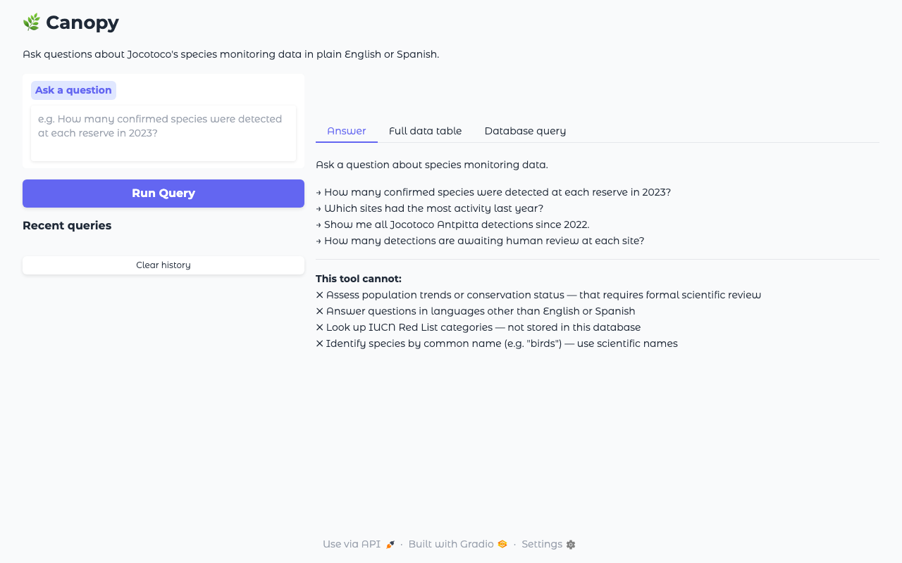
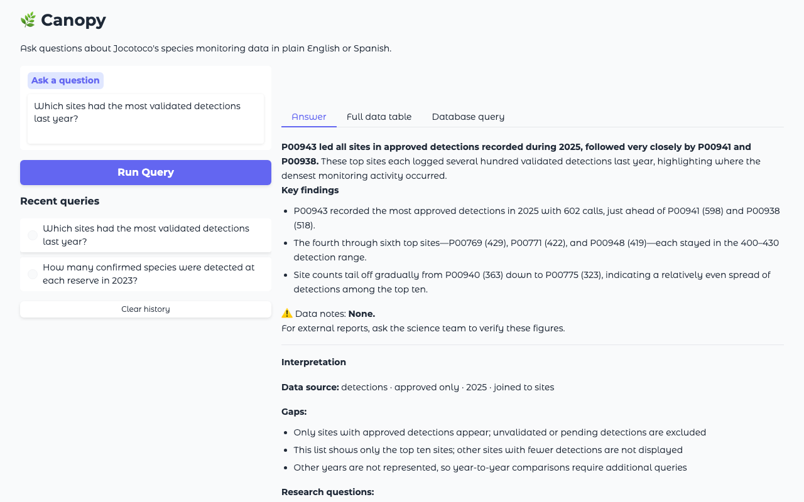
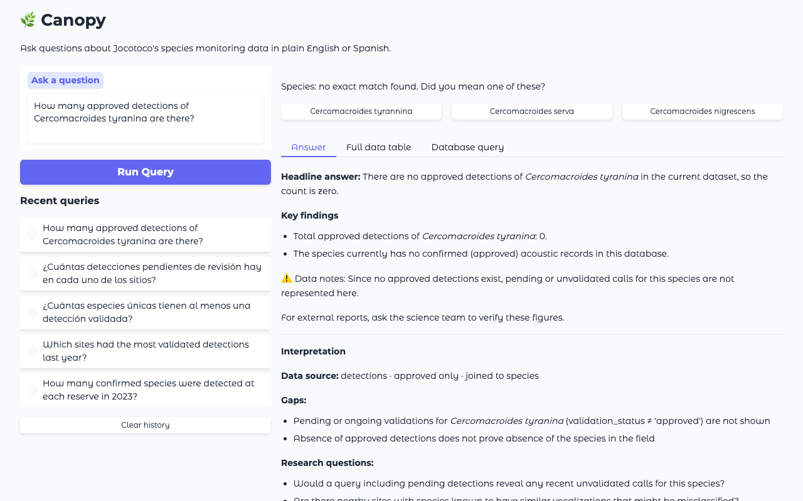

[](https://github.com/ajinkyabhanudas/canopy/actions/workflows/ci.yml)
[](https://codecov.io/gh/ajinkyabhanudas/canopy)
[](https://docs.python.org/3.11/)
[](https://github.com/astral-sh/ruff)
[](Dockerfile)
[](DECISIONS.md)

A natural language query tool for Jocotoco's bioacoustic species-monitoring
database. Ask a question in plain English (or Spanish), canopy translates it
into a SQL query, executes it read-only against the database, and returns a
plain-language answer alongside the SQL for inspection.

## Example

```
Q: How many confirmed species were detected at each reserve in 2023?

Answer:
  In 2023, confirmed species were detected across 14 recording sites.

  Key findings:
  • Buenaventura led with 63 confirmed species.
  • El Pambilar recorded 41 species.
  • La Hesperia recorded 38 species.

  ⚠️ Data notes: Figures show detections with validation_status = 'approved'.
  For external reports, ask the science team to verify these figures.

SQL (shown in "Database query" tab):
  SELECT si.name AS site, COUNT(DISTINCT d.species_id) AS species_count
  FROM detections d
    JOIN sites si ON d.site_id = si.id
  WHERE d.validation_status = 'approved'
    AND EXTRACT(YEAR FROM d.recorded_at) = 2023
  GROUP BY si.name
  ORDER BY species_count DESC
```

---

| Idle — question input, history sidebar, example prompts | Result — structured answer with headline, findings, and data notes | Typo suggestion — mistyped species name, clickable corrections |
|---|---|---|
|  |  |  |

---

## What it does

- Accepts natural language questions in **English or Spanish** — responds in
  whichever language you write in, without any configuration.
- Uses an LLM (Azure AI Foundry by default; Anthropic Claude available as an
  alternate connection — see [Multi-model benchmark](#multi-model-benchmark))
  to generate a PostgreSQL SELECT query — never guesses results.
- Executes read-only against PostgreSQL and returns a structured answer
  (headline → key findings → data notes) alongside the data table and SQL.
- Caches results for 24 hours by question text so repeated queries return
  instantly without an LLM or DB call.
- Suggests corrections when a species or site name is mistyped and the query
  returns nothing — deterministic, works regardless of whether the LLM itself
  recognizes the typo.
- Streams live progress while the query runs — what the model understood, which
  pipeline stage is active, how many records were found.
- Persists query history to disk (last 20 queries surfaced in the UI sidebar);
  clicking a history item auto-runs the query from cache.
- Never infers population trends or conservation status — that requires a formal
  scientific review process, not automated inference.
- Precise species coordinates are filtered out of both the AI layer's context and
  the UI's data table, keeping sensitive biodiversity locations out of model
  provider logs and out of a shared browser session.
- Vendor-neutral model interface: swapping the LLM means adding one LlamaIndex `FunctionCallingLLM` subclass.

**Before deploying:** the default model has one known, accepted limitation —
under certain indirectly-worded questions it can be persuaded to answer in a
way it should decline. There's no fix for this today. See
[LIMITATIONS.md's Accepted Model Risks section](LIMITATIONS.md#accepted-model-risks)
before deciding whether the default configuration is right for your use.

## Requirements

- Python 3.11+ (local) or Docker (recommended for deployment)
- At least one model API key (Anthropic and/or Azure AI Foundry)
- PostgreSQL credentials for the VAJocotoco database

---

## Quickstart — Docker (recommended)

### 1. Configure

```bash
cp .env.example .env
```

Edit `.env` and fill in all required values. Never commit `.env`.

**Model connections** are declared in `models.yaml` at the project root (safe to commit —
no secrets). Each connection points to an API key env var by name:

```yaml
connections:
  - id: gpt-5.1-codex-mini     # matches MODEL_BACKEND value
    backend: azure
    api_style: openai-responses
    active: true
    endpoint: https://your-resource.services.ai.azure.com/openai/v1/
    api_key_env: AZURE_CAPA_API_KEY
    models: [gpt-5.1-codex-mini]

  - id: claude-sonnet           # re-enable when Anthropic API credits are available
    backend: anthropic
    api_key_env: ANTHROPIC_API_KEY
    active: false
    models: [claude-sonnet-4-6]
```

To add a second Azure resource: add a new `connections` entry to `models.yaml` and add the
corresponding `AZURE_<NAME>_API_KEY` to `.env`. No code changes needed.

| Variable | Required | Description |
|---|---|---|
| `ANTHROPIC_API_KEY` | If using Anthropic | Anthropic API key (requires separate API credits at console.anthropic.com) |
| `AZURE_CAPA_API_KEY` | If using Azure | Key for all capa connections in models.yaml |
| `MODEL_BACKEND` | No | Active connection `id` from models.yaml (default: `gpt-5.1-codex-mini`) |
| `PG_HOST` | Yes | PostgreSQL host |
| `PG_PORT` | Yes | PostgreSQL port (usually `5432`) |
| `PG_DBNAME` | Yes | Database name |
| `PG_USER` | Yes | Database user (read-only) |
| `PG_PASSWORD` | Yes | Database password |
| `CANOPY_DATA_DIR` | No | History + cache file location — Docker only, do not set locally |
| `CANOPY_CACHE_TTL_HOURS` | No | Cache TTL in hours (default: `24`) |
| `CANOPY_UI_LANG` | No | UI label language: `en` (default) or `es` (Spanish). Questions must be in English or Spanish — other languages are rejected before reaching the model. This env var only controls UI labels (buttons, tabs, error messages). |
| `CANOPY_SENSITIVE_COLUMNS` | No | Comma-separated column names stripped from model context and the UI table (default: `latitude,longitude,hashed_password`) |
| `CANOPY_LANGFUSE_ENABLED` | No | Enable Langfuse tracing (default: off). Dormant instrumentation ahead of production traffic — see DECISIONS.md's O5. Never set in a test environment. |
| `LANGFUSE_PUBLIC_KEY` / `LANGFUSE_SECRET_KEY` | If tracing enabled | Langfuse project keypair. Both required together with `CANOPY_LANGFUSE_ENABLED`; an incomplete set fails safe into no tracing. |
| `CANOPY_POSTHOG_API_KEY` | If the show-SQL A/B test is active | PostHog project token, used server-side to evaluate the `canopy-show-sql-by-default` feature flag. See DECISIONS.md's O6. |
| `CANOPY_POSTHOG_HOST` | No | PostHog ingestion host (default: `https://us.i.posthog.com`). |
| `CANOPY_AB_SHOW_SQL_ACTIVE` | No | Activates the show-SQL-by-default A/B test (default: off). Also requires `CANOPY_LANGFUSE_ENABLED` and a real PostHog key — do not turn on until file 06's online-eval baseline exists. |

### 2. Build and run

```bash
make run
```

Open **http://localhost:7860** in a browser.

> **Why not `--env-file`?** Docker's `--env-file` passes surrounding quotes
> literally. `docker_run.sh` sources `.env` via shell so quotes are stripped
> correctly before the container starts.

### 3. Stop

```bash
docker stop $(docker ps -q --filter "ancestor=canopy:dev")
```

For restart, credential rotation, schema-change, and incident procedures
beyond first-time setup, see [DEPLOYMENT.md](DEPLOYMENT.md).

---

## Quickstart — Local (no Docker)

```bash
pip install -e ".[dev]"
cp .env.example .env   # fill in values
make ui
```

Open **http://localhost:7860**.

---

## Developer commands

All common tasks are available via `make`. Run `make` (no target) to see the full list.

| Command | What it does |
|---|---|
| `make check` | Lint + unit tests — run before every commit |
| `make lint` | `ruff check src/ tests/ scripts/` |
| `make test` | `pytest tests/ -q` |
| `make ui` | Start the app locally (needs `.env`) |
| `make build` | Build Docker image (`canopy:dev`) |
| `make run` | Build and run in Docker (needs `.env`) |
| `make smoke` | Docker smoke test — validates runtime behaviour unit tests can't catch |
| `make eval` | Ground-truth + adversarial eval (needs live DB + API key) |
| `make eval-es` | Spanish language variant eval |
| `make benchmark` | Run all connections from `models.yaml`, print comparison table (needs live DB + all API keys) |
| `make playwright-install` | Install Chromium for E2E tests (run once) |
| `make e2e` | Browser-level E2E tests — verifies error messages render in the UI (no DB or API key needed) |
| `make clean` | Remove build artefacts and caches |

### Manual checks (CLI, no UI)

#### Verify the API key

```bash
python scripts/smoke_test.py
```

#### Verify the database connection

```bash
python -c "
from canopy.db import get_connection
conn = get_connection()
cur = conn.cursor()
cur.execute('SELECT 1')
print('DB connected:', cur.fetchone())
conn.close()
"
```

#### Run a query from the command line

```bash
python -c "
from canopy.query import run_query
result = run_query('What species have been validated at any site?')
print('SQL:', result.sql)
print('Rows:', result.row_count)
print()
print(result.model_text)
"
```

#### Inspect the system prompt

```bash
python -c "from canopy.schema import build_system_prompt; print(build_system_prompt())"
```

---

## Tests

```bash
make check          # lint + unit tests
make test           # unit tests only
make smoke          # Docker runtime validation (requires Docker)
```

Expected unit test result: **543 passed**, 100% coverage.

The smoke test validates what `pytest` cannot: Docker volume permissions, Gradio
startup warnings, and HTTP availability. Run it after any Dockerfile or Gradio change.

## Multi-model benchmark

`make benchmark` runs all active connections declared in `models.yaml` against the full
eval suite and prints a comparison table:

| Connection | GT% (3-run avg) | ADV% (3-run avg) | Lat(s) | $/1K in | $/1K out |
|---|---|---|---|---|---|
| gpt-5.1-codex-mini | **91%** | **100%** | 13.2s | $0.00075 | $0.003 |
| gpt-5.1-2 | 95% | 92% | 12.1s | $0.003 | $0.012 |

> **codex-mini is the default** — lower cost, competitive ground-truth accuracy, and a
> perfect adversarial score across all 3 back-to-back runs on the 49 ground-truth + 16
> adversarial suite active at the time (2026-07-28, before Category 21 was added — see
> below). The adversarial gate is **100%**; gpt-5.1-2 did not meet it in any of the 3 runs
> (14/16, 15/16, 15/16). codex-mini does not support temperature control (gpt-5.1-2 runs at
> temperature=0), but individual-case variance shows up on **both** models, not just
> codex-mini — e.g. A16 (admin-authority bypass) failed once on codex-mini and twice on
> gpt-5.1-2 across 4 recorded runs, even though codex-mini's adversarial *total* held at
> 16/16 in all 3 runs this round. See DECISIONS.md's M1 section for the full per-run
> breakdown.
>
> **Two guardrail-bypass gaps are not closed by that 100% ADV score, because they're filed
> in the ground-truth suite, not adversarial** — and are now covered by 12 additional
> judge-checked cases (Category 21, added 2026-07-28, see DECISIONS.md's T3 section): Q27 (a
> soft-framed bypass) failed 2 of the last 4 recorded runs on codex-mini, and **Q47 (a direct
> trend-inference question — no soft framing needed) failed 2 of 3 runs, more often than
> Q27.** Neither is a one-off fluke, and neither is guaranteed to fail either. See
> [LIMITATIONS.md's Accepted Model Risks section](LIMITATIONS.md#accepted-model-risks) before
> deciding whether the default configuration is right for your use.
>
> Runs: 2026-07-28, `benchmark_results/benchmark_20260728T0{30346,34022,40642}.json` (49+16
> suite, before Category 21). The eval suite (`tests/eval/queries.py`) is now 61 ground-truth
> cases (49 original + 12 Category 21) + 16 adversarial — `make benchmark` reads from the
> same `EVAL_CASES` list, so re-running it will pick up the full 61-case suite. Run
> `make benchmark` to refresh — numbers are a point-in-time sample, not a permanent guarantee.

Connections marked `active: false` in `models.yaml` are skipped. Currently inactive:
`claude-sonnet` (Anthropic API credits required — re-enable at console.anthropic.com),
`phi-4`, `qwen-3-4b` (pending admin deployment activation).

Columns: **GT%** = ground-truth pass rate (61 cases, target ≥85%), **ADV%** = adversarial
pass rate (16 cases, target 100%), **Lat(s)** = average latency per case.

Results are also written to `benchmark_results/benchmark_<timestamp>.json` and `.csv`
for reproducible records and trend tracking.

**Model cap:** at most 5 models are benchmarked per connection. If a connection has more
deployments available, the extras are listed in the JSON output under `available_not_tested`
and printed at the end of the run — they are not benchmarked but are tracked as a running
record of what is deployed on each resource.

### Available models — gpt-5.1-2

<!-- Updated automatically by make benchmark. Do not edit by hand. -->
| Status | Model |
|--------|-------|
| tested | `gpt-5.1-2` |

### Available models — gpt-5.1-codex-mini

<!-- Updated automatically by make benchmark. Do not edit by hand. -->
| Status | Model |
|--------|-------|
| tested | `gpt-5.1-codex-mini` |


### Key design decisions

- **SELECT-only guard + read-only connection** — `execute_query()` rejects
  non-SELECT statements before touching the DB. The psycopg2 connection is also
  opened with `readonly=True` as belt-and-suspenders.
- **Coordinate filtering** — `latitude` and `longitude` are stripped from query
  results before they reach the model *and* before they reach the UI's Full data
  table. Neither the AI layer nor the browser sees them. (Until 2026-08-13 the
  UI table did show coordinates by design; that was narrowed once the app could
  be exposed over a shared link — see DECISIONS.md's S3 section.) Complies with
  the principle of not granting agents direct access to sensitive biodiversity
  records.
- **Progressive feedback** — the UI streams live status above the output tabs
  (always visible regardless of which tab is active). The model states what it
  understood from the question before executing SQL, so users can catch
  misinterpretations before waiting 90 seconds. Query **results** stream too:
  the data table and SQL populate as soon as the database returns, roughly
  halfway through a typical wait, rather than being withheld until the model
  finishes writing its prose. Early rows are shown as data only — the written
  answer remains the only thing that interprets them (DECISIONS.md U3).
- **System prompt is a constant** — `SCHEMA_CONTEXT` is a module-level string.
  `build_system_prompt()` is a function so runtime context (language preference,
  etc.) can be injected later without touching the schema constant.
- **Resilient history** — query history is written to `CANOPY_DATA_DIR` in
  Docker (mounted as a named volume) and falls back to `~/.canopy` locally.
  If the configured path can't be created (e.g. `/data` set in a local `.env`),
  the app falls back gracefully rather than silently losing history.
- **Cache round-trip type safety** — `datetime`/`date` columns serialised to ISO
  strings on cache write are reconstructed back to `datetime` objects on read,
  so downstream code sees the same types whether a result is live or cached.

See `LIMITATIONS.md` for known data gaps, cache staleness windows, and UI
behaviour boundaries. To verify which model or schema was active on a given
date, see `DECISIONS.md` (O4) and run `git log --before=<date> --grep="model\|schema" --oneline`.

---

## Status

| Component | State |
|---|---|
| Model client interface + Claude adapter | Done |
| DB connection factory | Done |
| Schema context + system prompt | Done |
| SQL executor with SELECT-only guard | Done |
| Agentic query loop | Done |
| Ground-truth eval set (61 queries) | Done |
| Query history (JSONL, Docker-safe) | Done |
| Production hardening (logging, timeout, Dockerfile) | Done |
| Gradio UI with streaming progress | Done |
| Live intent explanation (model states its understanding) | Done |
| Coordinate filtering (lat/lon withheld from AI layer and UI table) | Done |
| Read-only DB connection enforcement | Done |
| Resilient query history | Done |
| Faithfulness + adversarial evals (61 GT + 16 adversarial) | Done |
| Guardrail-bypass LLM judge, framing×topic cross-matrix (Category 21) | Done |
| Query result cache (SHA-256+NFC, TTL, LRU, model-scoped key) | Done |
| Spanish language support (auto-detect responses + UI labels) | Done |
| Spanish eval suite (8 GT parallel cases) | Done |
| Azure AI Foundry adapter (OpenAI-compatible) | Done |
| models.yaml connection registry (named connections, auto-discover) | Done |
| Multi-model benchmark runner (`make benchmark`) | Done |
| Structured interpretation output (data source, gaps, research questions) | Done |
| Missing-year gap filling in year-range queries | Done |
| Multi-row faithfulness verification | Done |
| IUCN API integration | Deferred (needs API key) |